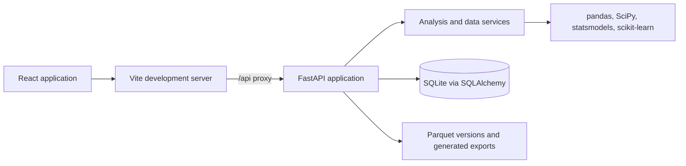

# Methodica

[](https://www.python.org/)
[](https://fastapi.tiangolo.com/)
[](https://react.dev/)
[](https://vite.dev/)

**An evidence-first statistical analysis workbench.** Methodica helps you move from a dataset and research question to an inspectable analysis: profile the data, review quality issues, select a statistical method, inspect assumptions, run the computation, and export a report.

```text
data → quality review → method → assumptions → analysis → validation → interpretation
```

> Methodica is a research and analytics aid, not a substitute for statistical review. Check model choices, assumptions, and conclusions in the context of your study.

## Contents

- [Highlights](#highlights)
- [Technology stack](#technology-stack)
- [Architecture](#architecture)
- [Repository structure](#repository-structure)
- [Prerequisites](#prerequisites)
- [Quick start](#quick-start)
- [Using Methodica](#using-methodica)
- [Sample datasets](#sample-datasets)
- [API overview](#api-overview)
- [End-to-end API example](#end-to-end-api-example)
- [Cleaning operations](#cleaning-operations)
- [Statistical methods](#statistical-methods)
- [Configuration and data storage](#configuration-and-data-storage)
- [Development](#development)
- [Troubleshooting](#troubleshooting)
- [Security and limitations](#security-and-limitations)
- [License](#license)

## Highlights

- **Dataset intake and profiling:** Upload CSV, TSV, Excel, JSON, Parquet, or SQLite files; import from a SQLAlchemy-supported database; or load a bundled sample.
- **Quality review and cleaning:** Inspect missing values, duplicates, and other quality signals. Apply supported cleaning operations explicitly and keep dataset versions for undo and restore.
- **Exploration:** Review descriptive summaries and create common exploratory charts.
- **Method recommendation:** Describe a research question in plain language to get a deterministic method recommendation, candidate variables, rationale, and assumption checks. Methods can also be selected directly.
- **Statistical analysis:** Run methods across hypothesis testing, regression, ANOVA, association, time series, multivariate analysis, survival, reliability, and study design.
- **Reproducibility:** Analysis records include method parameters and dataset-version provenance; saved analyses can be replayed.
- **Reports and exports:** Generate reports in HTML, Markdown, DOCX, PDF, XLSX, CSV, or JSON. Export dataset tables as CSV, XLSX, Parquet, or JSON.
- **Local workspace:** The API and frontend run locally during development. No external LLM service is used for the recommendation or assistant endpoints; those operate on application data and computed results.

## Technology stack

| Layer | Technologies |
| --- | --- |
| Frontend | React 18, Vite 6, React Router, Tailwind CSS |
| Backend | Python, FastAPI, Uvicorn |
| Data and statistics | pandas, NumPy, SciPy, statsmodels, scikit-learn, pingouin, lifelines |
| Persistence | SQLAlchemy with SQLite by default; Parquet dataset versions |

## Architecture



The browser uses relative `/api` URLs; during development Vite proxies those requests to FastAPI. Dataset metadata and analysis records are stored in SQLite, while versioned working datasets and generated files live under `storage/`. Statistical methods are implemented in the backend service layer and exposed through the method registry.

## Repository structure

```text
.
├── backend/
│   ├── app/
│   │   ├── main.py                 # FastAPI routes and application setup
│   │   ├── auth.py                 # Optional JWT auth and guest workspace
│   │   ├── config.py               # Runtime paths and settings
│   │   └── services/
│   │       ├── io_load.py          # File and SQL ingestion
│   │       ├── profile.py          # Dataset profiling
│   │       ├── quality.py          # Data quality checks
│   │       ├── cleaning.py         # Versioned transformations
│   │       ├── recommend.py        # Question-to-method recommendation
│   │       ├── assumptions.py      # Assumption checks
│   │       ├── stats_engine.py     # Statistical method registry
│   │       ├── validate.py         # Result validation and warnings
│   │       ├── autopilot.py        # End-to-end analysis workflow
│   │       ├── assistant.py        # Answers based on computed output
│   │       ├── visualize.py        # Chart generation
│   │       └── reports.py          # Report generation and export
│   ├── requirements.txt
│   └── sample_data/                # Bundled CSV examples
├── frontend/
│   ├── package.json
│   ├── vite.config.js              # Dev server and /api proxy
│   └── src/
│       ├── api.js                  # Frontend API client
│       ├── App.jsx
│       ├── components.jsx
│       └── pages/                  # Application screens
└── storage/                        # SQLite database, uploads, and reports
```

## Prerequisites

- Python 3.11 or later
- Node.js 20 or later and npm
- A supported local development environment (Linux, macOS, or Windows/WSL)

The Python dependency list is in `backend/requirements.txt`; the frontend dependency lockfile is `frontend/package-lock.json`. Python dependencies are currently unpinned, so resolve and lock versions for reproducible deployments.

## Quick start

### 1. Install dependencies

From the repository root, create and activate a virtual environment for your shell:

```bash
# Linux / macOS / WSL
python3 -m venv .venv
source .venv/bin/activate
```

```powershell
# Windows PowerShell
py -3 -m venv .venv
.venv\Scripts\Activate.ps1
```

Then install the backend and frontend dependencies:

```bash
python -m pip install --upgrade pip
python -m pip install -r backend/requirements.txt

cd frontend
npm ci
cd ..
```

### 2. Start the API

In one terminal, from the repository root. Use the command for your platform:

```bash
# Linux / macOS / WSL
.venv/bin/python -m uvicorn app.main:app --app-dir backend --reload --host 0.0.0.0 --port 8000
```

```powershell
# Windows PowerShell
.venv\Scripts\python.exe -m uvicorn app.main:app --app-dir backend --reload --host 0.0.0.0 --port 8000
```

### 3. Start the frontend

In a second terminal:

```bash
cd frontend
npm run dev
```

Open **http://localhost:5173**. Vite forwards `/api` requests to the backend at `http://127.0.0.1:8000`.

| Service | Local URL |
| --- | --- |
| Web application | http://localhost:5173 |
| API | http://localhost:8000 |
| Interactive API docs | http://localhost:8000/docs |
| Health check | http://localhost:8000/api/health |

Verify the API is running:

```bash
curl http://localhost:8000/api/health
```

Expected response:

```json
{"ok":true,"app":"Methodica","version":"1.0.0"}
```

The backend seeds a demo account on startup (for direct API authentication):

```text
Email:    demo@methodica.app
Password: demo1234
```

The frontend opens directly into a guest workspace; it does not require a sign-in. Unauthenticated API requests use the same guest workspace. The demo account can be used with `POST /api/auth/login` when testing authenticated API requests. Do not use the demo account or guest behavior for a public deployment.

## Using Methodica

1. Open the app; it starts in a local guest workspace.
2. Load a sample dataset or upload your own from **Data**.
3. Review the profile and quality findings. Apply any desired cleaning operations; changes are versioned.
4. In **Analyze**, enter a research question and inspect the recommendation, or select a method in **Models**.
5. Review assumptions and validation warnings alongside the computed result.
6. Use **Autopilot** for a guided workflow, **Explore** for descriptive analysis and charts, or **Reports** to create an export.

Example questions:

```text
Is PM2.5 different between urban and rural locations?
Is temperature associated with PM2.5?
Does the intervention change follow-up scores?
```

## Sample datasets

Bundled samples are in `backend/sample_data/` and are also available from the Data screen or API.

| API identifier | File | Rows | Example content |
| --- | --- | ---: | --- |
| `air` | `air_quality.csv` | 722 | Air quality, weather, date, and monitoring location |
| `clinical` | `clinical_trial.csv` | 260 | Trial groups, baseline/follow-up scores, and survival fields |
| `survey` | `survey_items.csv` | 180 | Eight survey items and a group field |

Load one with the API:

```bash
curl -X POST http://localhost:8000/api/datasets/sample/air
```

## API overview

The complete, live OpenAPI reference is available at [`/docs`](http://localhost:8000/docs) when the backend is running. Most endpoints accept and return JSON; file uploads use `multipart/form-data`.

| Method | Endpoint | Purpose |
| --- | --- | --- |
| `GET` | `/api/health` | Health and version information |
| `POST` | `/api/auth/register`, `/api/auth/login` | Create an account or obtain a token |
| `GET`, `POST`, `DELETE` | `/api/projects` and `/api/projects/{id}` | List, create, or delete projects |
| `GET` | `/api/dashboard` | Workspace summary |
| `POST` | `/api/datasets/upload` | Upload one or more data files (`files` form field) |
| `POST` | `/api/datasets/from-sql` | Import a SQL query or table |
| `POST` | `/api/datasets/sample/{which}` | Load a bundled sample (`which`: `air`, `clinical`, or `survey`) |
| `GET`, `DELETE` | `/api/datasets` and `/api/datasets/{id}` | List, inspect, or delete datasets |
| `GET` | `/api/datasets/{id}/preview` | Preview dataset rows |
| `GET` | `/api/datasets/{id}/profile` | Profile columns and data quality |
| `GET` | `/api/datasets/{id}/quality` | Quality findings and suggested operations |
| `GET` | `/api/datasets/{id}/history` | List dataset versions and transformations |
| `POST` | `/api/datasets/{id}/clean` | Apply cleaning operations and create a version |
| `POST` | `/api/datasets/{id}/undo`, `/api/datasets/{id}/restore` | Move to a previous version |
| `POST` | `/api/datasets/{id}/explore`, `/api/datasets/{id}/group`, `/api/datasets/{id}/chart` | Explore data, compare groups, or generate a chart |
| `GET` | `/api/methods` | List methods available to the analysis engine |
| `POST` | `/api/datasets/{id}/recommend` | Recommend a method for a research question |
| `POST` | `/api/datasets/{id}/assumptions` | Evaluate method assumptions |
| `POST` | `/api/datasets/{id}/analyze` | Run an analysis |
| `POST` | `/api/datasets/{id}/autopilot` | Run the guided analysis workflow |
| `POST` | `/api/datasets/{id}/assistant` | Ask about the dataset or computed results |
| `GET` | `/api/analyses` and `/api/analyses/{id}` | List or inspect saved analyses |
| `POST` | `/api/analyses/{id}/reproduce` | Replay a saved analysis |
| `POST` | `/api/datasets/{id}/report` | Generate a report |
| `GET` | `/api/reports`, `/api/reports/{id}/download` | List reports or download a report |
| `POST` | `/api/datasets/{id}/export` | Export the working dataset |

For direct API use with a registered account, send `Authorization: Bearer <token>`. The API currently falls back to a guest workspace when no valid token is supplied.

## End-to-end API example

The following shell example loads the air-quality sample, gets a recommendation, and runs a named method. Run it in Bash with the backend available on port `8000`. The sample columns include `temperature` and `pm25`.

```bash
DATASET_ID=$(curl -s -X POST http://localhost:8000/api/datasets/sample/air \
  | python -c 'import json,sys; print(json.load(sys.stdin)["id"])')

echo "Dataset: $DATASET_ID"

# Ask the recommender to select a method and variables.
curl -s -X POST "http://localhost:8000/api/datasets/$DATASET_ID/recommend" \
  -H 'Content-Type: application/json' \
  -d '{"question":"Is temperature associated with PM2.5?"}'

# Run Pearson correlation explicitly.
curl -s -X POST "http://localhost:8000/api/datasets/$DATASET_ID/analyze" \
  -H 'Content-Type: application/json' \
  -d '{"method":"pearson","params":{"x":"temperature","y":"pm25"},"question":"Is temperature associated with PM2.5?"}'
```

An analysis response includes the computed result, assumption checks, validation flags, provenance, and a chart payload. The UI and `/docs` expose the full response fields.

Generate a Markdown report for a question (the endpoint runs an analysis if no saved analysis is supplied):

```bash
curl -X POST "http://localhost:8000/api/datasets/$DATASET_ID/report" \\
  -H 'Content-Type: application/json' \\
  -d '{"question":"Is temperature associated with PM2.5?","style":"scientific","format":"md"}'
```

The response includes a report ID and download path. Supported report formats are `html`, `md`/`markdown`, `docx`, `pdf`, `xlsx`/`excel`, `csv`, and `json`.

Upload a local file with multipart form data:

```bash
curl -X POST http://localhost:8000/api/datasets/upload \
  -F 'files=@backend/sample_data/air_quality.csv'
```

Import from SQL with JSON (choose a connection URL appropriate for your database):

```json
{
  "url": "sqlite:////absolute/path/to/source.db",
  "query": "SELECT * FROM measurements",
  "name": "Measurements extract"
}
```

Then send that object as the JSON body to `POST /api/datasets/from-sql`. Treat this endpoint as privileged; see [Security and limitations](#security-and-limitations).

## Cleaning operations

Cleaning uses `POST /api/datasets/{id}/clean`. Send one or more operations; successful requests create a new dataset version. Example:

```json
{
  "operations": [
    {"operation": "drop_duplicates"},
    {"operation": "impute", "column": "pm25", "method": "median"}
  ]
}
```

Supported operation names are `drop_duplicates`, `drop_columns`, `drop_rows_missing`, `impute`, `impute_all`, `to_numeric`, `parse_dates`, `strip`, `normalize_case`, `winsorize`, `clip_nonnegative`, `transform`, `encode`, `rename`, and `filter`. Parameters vary by operation; use the frontend quality-review flow or inspect `backend/app/services/cleaning.py` for each operation's options. Use `POST /api/datasets/{id}/undo` to move back one version or `POST /api/datasets/{id}/restore` with `{"version": 1}` to select a version.

## Statistical methods

The source of truth for supported methods and required inputs is `backend/app/services/stats_engine.py` (`REGISTRY` and `METHOD_META`). The available registry includes:

| Category | Methods |
| --- | --- |
| Descriptive and normality | Descriptive statistics, frequency tables, Shapiro–Wilk, Anderson–Darling, Kolmogorov–Smirnov |
| Correlation and association | Pearson, Spearman, Kendall, correlation matrix, chi-square, Fisher's exact test, Cramér's V |
| Hypothesis tests | One-sample, independent, and paired t-tests; z-test; Mann–Whitney U; Wilcoxon; Kruskal–Wallis; Friedman |
| ANOVA | One-way, two-way, repeated-measures, ANCOVA, Tukey HSD, Levene's test |
| Regression | Linear, multiple linear, polynomial, logistic, Poisson, negative binomial, robust regression |
| Time series | Trend, moving average, ACF/PACF, ARIMA, SARIMA, exponential smoothing, seasonality |
| Multivariate | PCA, factor analysis, MANOVA, K-means, discriminant analysis |
| Nonparametric | Bootstrap confidence interval, permutation test |
| Survival | Kaplan–Meier, log-rank, Cox proportional hazards |
| Reliability and design | Cronbach's alpha, effect size, power analysis, sample-size estimation |

Methodica orchestrates method recommendation, input parameters, assumption checks, validation, and provenance. Statistical calculations are performed using the underlying scientific Python libraries.

## Configuration and data storage

Settings and storage paths are currently defined as constants in `backend/app/config.py` (they are **not** read from environment variables):

| Setting | Default |
| --- | --- |
| Database | `storage/methodica.db` (SQLite) |
| Uploaded dataset versions | `storage/uploads/` (Parquet) |
| Generated reports | `storage/reports/` |
| Dataset exports | `storage/exports/` |
| Maximum upload size | 80 MB per file |
| Maximum preview size | 200 rows |
| JWT signing key | Development key in `backend/app/config.py` |

The backend creates required directories at startup. Keep the `storage/` directory backed up if you need to retain local datasets, analyses, or reports. The configured database can be changed in code using a SQLAlchemy connection URL, but the application has not been validated here as a production deployment.

## Development

### Run services with reload

```bash
# API (from repository root)
.venv/bin/python -m uvicorn app.main:app --app-dir backend --reload --host 0.0.0.0 --port 8000

# Frontend (from a second terminal)
cd frontend
npm run dev
```

### Build the frontend

```bash
cd frontend
npm run build
```

The production build is written to `frontend/dist/` (generated output; not committed).

### Add a statistical method

1. Implement the method in `backend/app/services/stats_engine.py` using the existing result conventions.
2. Register its identifier in `REGISTRY` and describe its input requirements in `METHOD_META`.
3. Add assumption checks in `backend/app/services/assumptions.py` where appropriate.
4. Update `backend/app/services/recommend.py` if the method should be selected automatically.
5. Run the API and exercise the method through `/docs` and the UI.

Frontend screens are under `frontend/src/pages/`; shared UI components live in `frontend/src/components.jsx`, and API calls are organized in `frontend/src/api.js`.

There is currently no dedicated automated test or lint command configured in the repository. A Python syntax check can be run with:

```bash
python -m compileall backend/app
```

## Troubleshooting

- **API import fails with `No module named app`:** run Uvicorn from the repository root using the documented `--app-dir backend` option.
- **The UI cannot reach the API:** confirm the API responds at `http://localhost:8000/api/health`; the Vite proxy target is configured in `frontend/vite.config.js`.
- **A data file is rejected:** check that it uses a supported extension and is no larger than 80 MB per file. Parsing errors are returned by the API.
- **An analysis cannot run:** inspect its required inputs in `GET /api/methods`, the returned recommendation, and the assumptions / validation output; required columns and data types depend on the method.

## Security and limitations

- The defaults are for local development, **not a secure public deployment**. The JWT secret is hard-coded, CORS allows all origins, and unauthenticated or invalid-token requests are mapped to a shared guest user.
- The SQL import endpoint accepts a connection URL and executes the supplied query or table lookup. Do not expose it to untrusted callers; restrict network access and validate credentials and query permissions.
- Do not upload sensitive or regulated data unless your deployment has been reviewed and secured for that use.
- Results depend on the selected method, data quality, assumptions, and study design. A successful calculation does not establish causality or guarantee that a method is appropriate.
- The analysis engine runs synchronously in the API process; large datasets or computationally intensive models may take significant resources.
- Recommender behavior is deterministic and rule-based; it is not a general-purpose natural-language model.

## License

No `LICENSE` file is present in this repository. Until a license is added, no license permissions are granted by this README; check with the repository owner before using or redistributing the code.